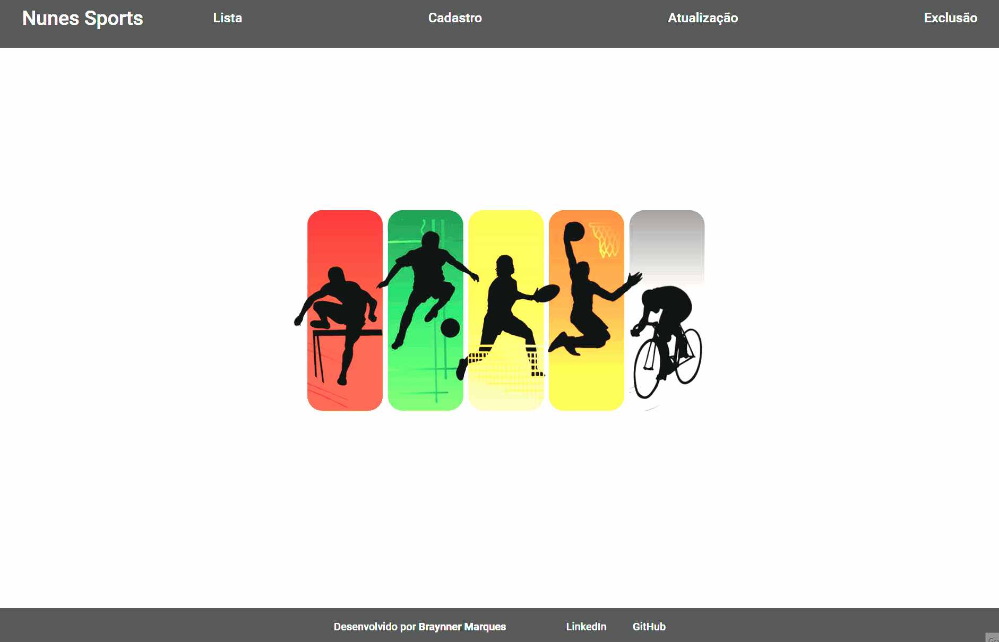

# Teste Técnico - Everymind
Esta é uma solução para o teste técnico Best minds 2024 - pessoa desenvolvedora trainee proposto pela [Everymind](https://everymind.com.br/) no processo seletivo para vaga de trainee.

## Índice

- [Visão geral](#visão-geral)
  - [O desafio](#o-desafio)
  - [Captura de tela](#captura-de-tela)
  - [Links](#links)
- [Meu processo](#meu-processo)
  - [Construído com](#construído-com)   
  - [Recursos úteis](#recursos-úteis)
- [Autor](#autor)
- [Agradecimentos](#agradecimentos)

## Visão geral

### O desafio

Neste desafio a pessoa candidata terá total liberdade de usar as ferramentas e linguagens que está mais familiarizado. O objetivo principal será identificar sua criatividade e a capacidade de resolver um problema, principalmente o potencial de implementação, qualidade de código, organização, boas práticas, conceitos de Clean Code, SOLID e preocupação com desenvolvimento para grandes volumes transacionais. Você é responsável por desenvolver a solução, definir o modelo de entrega, utilizando-se das ferramentas de mercado atuais, bem como por pensar em compartilhamento de código, versão de fontes etc.

O desafio consiste em criar uma solução para atender um requisito de um projeto:

- Nosso cliente fictício será a empresa Nunes Sports e foi solicitado pelo board da empresa que seja desenvolvido um sistema para exibição, criação, edição e deleção dos produtos vendidos pela companhia. Os requisitos necessários para a entrega são:

  - Ter uma base de dados com uma tabela produtos com os campos:
    - Nome do produto
    - Código do produto
    - Descrição do produto
    - Preço do produto

  - Criar uma página web na tecnologia de sua preferência para o CRUD de produtos.

  - Nessa página o usuário deverá ter a habilidade de exibir os produtos em uma tabela, criar, editar e deletar produtos que estão salvos na base.

  - Todas as ações na página deverão refletir no banco de dados.

- IMPORTANTE: O projeto deverá estar em um repositório do git para conferência. 

- Compartilhe no link disponível na página da WallJobs, o seu github, com as informações para acesso.

### Captura de tela

### Links

- URL da solução: [Github](https://github.com/BraynnerM/NunesSports)
- URL do App na Vercel: [Teste técnico Front-end | React](https://nunes-sports-frontend.vercel.app/)
- URL da API no Render: [Teste técnico Back-end | Express](https://nunes-sports.onrender.com/api/produtos/)
## Meu processo

### Construído com

- Marcação semântica HTML5 
- Propriedades personalizadas do CSS
- React.JS
- Node.JS
- Express
- Prisma
- PostgreSQL
- AWS

### Recursos úteis

- [Thunder Client](https://www.thunderclient.com/) - Utilizei para verificar se as rotas criadas no backend estavam funcionando e executando suas tarefas adequadamente.
- [Azure Data Studio](https://azure.microsoft.com/pt-br/products/data-studio) - Utilizei para criar uma instancia do banco de dados e interligar ao banco de dados criado na AWS.

## Autor

- Linkedin - [BraynnerM](https://www.linkedin.com/in/braynner/)
- Github - [BraynnerM](https://github.com/BraynnerM)
- Frontend Mentor - [BraynnerM](https://www.frontendmentor.io/profile/BraynnerM)
- Twitter - [BraynnerMarques](https://twitter.com/BraynnerMarques)
- E-mail - [braynnermarques@hotmail.com](mailto:braynnermarques@hotmail.com)

## Agradecimentos

Agradeço a [Everymind](https://everymind.com.br/) por me oferecer esta oportunidade de demonstrar meus conhecimentos.
